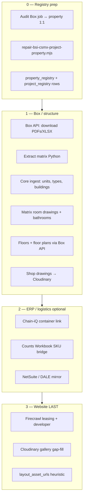

# BSI-CSMX Property Enrichment — Full Process

Formal end-to-end pipeline for **BSI** and **CSMX** millwork student-housing properties: canonical **project ↔ property** linkage, then multi-source enrich into Registry-iQ, with **Firecrawl website scrape last**.

Reference implementations: **Troubadour** (`25019` / `095960e3-…`) and **Morgan Hill** (`25048` / `a30d446c-…`).

---

## Scope: what counts as a “project”

| Layer | ID pattern | Registry home | Property rule |
|-------|------------|---------------|---------------|
| **BSI site job** | `25xxx` / `253xx` Box folder prefix | `project_registry.project_id` | **Exactly one** `property_registry` row per site job |
| **Factory PO** | e.g. `25198`, `25199` (Sanyang Main/Overage) | `project_registry` child of parent | **Same property** as parent site job (not a second property) |
| **UF/Sage deal** | e.g. `26-048-I` | May also link to same property | FF&E channel; separate from millwork job |

**Active Box millwork set (Jul 2026):** 48 Box folders → **47 canonical site jobs** (folder `25015-Madison…` maps to project `25315`, not `25015`).

Audit:

```bash
cd "/Users/geoffreyjackson/Dropbox/The Living Company/TLC iQ/Property_Registry"
node scripts/audit-bsi-csmx-project-property.mjs
node scripts/audit-bsi-csmx-project-property.mjs --band=25001-25026
```

Repair known gaps:

```bash
node scripts/repair-bsi-csmx-project-property.mjs --dry-run
node scripts/repair-bsi-csmx-project-property.mjs --apply
```

Reports: `.firecrawl/bsi-csmx-project-property-audit.json`, `…-repair.json`.

---

## Source inventory (all inputs)

| # | Source | System / path | What it provides | Script / access |
|---|--------|---------------|------------------|-----------------|
| 1 | **Box Content API** | Box-iQ app CCG (`BOX_IQ_CLIENT_*`) | PDF/XLSX bytes without Drive hydration | `scripts/lib/box-api-download.mjs`, `--via-box-api` |
| 2 | **Box Drive** | `~/Library/CloudStorage/Box-Box/Team Folder/Projects/25xxx-…` | Folder paths, metadata-only index | **Do not read PDFs** from Drive (cloud-only hang) |
| 3 | **Unit matrix** | `…/SHOP DRAWINGS/*Matrix*.xlsx` | Units, types, kitchen/vanity codes, levels | `extract-*-matrix.py` → `.firecrawl/*-matrix.json` |
| 4 | **Shop drawings** | `…/Cabinets/DS PDFs/MW*.pdf` | Cabinet configs → Cloudinary + `property_shop_drawings` | `ingest-*-25198-complete.mjs`, `ingest-morganhill-assets.mjs` |
| 5 | **Matrix drawings** | Countertop / kitchen / bath PDF index | `property_unit_types.room_drawings` | `ingest-troubadour-matrix-drawings.mjs` |
| 6 | **Architectural floor plans** | `A2-0N LEVEL N OVERALL FLOOR PLAN.pdf` | `property_floors.floor_plan_url`, PNG thumbs | `ingest-troubadour-floor-plans.mjs --via-box-api` |
| 7 | **IFC / permit sets** | Morgan Hill `02. IFC/`, stamped permit | `project_registry.documents` | `ingest-morganhill-project-links.mjs` |
| 8 | **Chain-iQ** | `container_loads` by project name | Container ↔ `project_registry_id` | `ingest-*-complete.mjs`, `ingest-morganhill-project-links.mjs` |
| 9 | **NetSuite portfolio** | DALE-Demand `netsuite_jobs_portfolio` | Job revenue, developer partner, job id | `ingest-troubadour-phase3.mjs` |
| 10 | **Counts Workbook** | Box `Counts Workbook*.xlsx` MW tabs | `property_unit_type_skus` (kitchen/vanity) | `ingest-troubadour-phase2/3.mjs`, `ingest-morganhill-skus.mjs` |
| 11 | **DALE Production** | Production Supabase `deals` / `requirements` | FF&E SKU bridge (UF path) | `sync-production-to-registry.mjs` |
| 12 | **BSI_ProjectSetup** | Airtable archaeology | Legacy property fields, contacts | `ingest-property-archaeology.mjs` |
| 13 | **Access 2013** | `Access/2013SQLite.db` | Historical project/property seeds | `ingest-access-2013-sqlite.mjs` |
| 14 | **Leasing / dev websites** | Firecrawl (last step) | Hero, gallery, floorplan images, brand, developer | `enrich-bsi-csmx-website.mjs` |

**Authority order:** Box matrix + shop drawings > Chain-iQ > NetSuite > website gap-fill.

---

## Enrichment phases (ordered)



### Phase 0 — Project ↔ property (mandatory)

1. Every Box site job (`25xxx` / `253xx`) has one `project_registry` row with unique `project_id`.
2. That row’s `property_id` points to exactly one `property_registry` row.
3. Factory POs (`25198`, …) share the parent property (`25019` → Troubadour).
4. Run audit after any new Box folder appears.

**Known Box collisions:**

| Box folder | Canonical `project_id` | Property |
|------------|------------------------|----------|
| `25015-Ann Arbor, MI - HUB` | `25015` | HUB ANN ARBOR |
| `25015-Madison, WI - HUB - J+B` | `25315` (not `25015`) | Hub Madison 2024 Acquisition |

### Phase 1 — Box structure (use Box API, not Drive)

```bash
cd "/Users/geoffreyjackson/Dropbox/The Living Company/TLC iQ/Property_Registry"

# Full orchestrator (property-specific config)
node scripts/ingest-bsi-csmx-property.mjs \
  --config=scripts/config/troubadour-lubbock-bsi-csmx.json \
  --apply

# Floor plans only (Box API → Cloudinary)
node scripts/ingest-troubadour-floor-plans.mjs --apply --via-box-api
```

**Box API credentials (Jul 2026):**

| Variable | App | Notes |
|----------|-----|-------|
| `BOX_IQ_CLIENT_ID` / `BOX_IQ_CLIENT_SECRET` | Box-iQ | Enterprise CCG **works** |
| `BOX_CLIENT_ID` / `BOX_CLIENT_SECRET` | Legacy app | `unauthorized_client` on enterprise subject — do not use |
| `BOX_ENTERPRISE_ID` | `6449953` | Shared |

Downloads cache: `.cache/troubadour-floor-plans-box/` (or `--staging-dir`).

**Drive path rule:** `~/Library/CloudStorage/Box-Box/…` is OK for **existence checks and metadata** (`--metadata-only`). Never `readFileSync` full PDFs from Drive in batch jobs.

### Phase 2 — ERP / SKU (per property flags)

| Step | When | Output |
|------|------|--------|
| Chain-iQ containers | Factory PO / project name match | `container_loads.project_registry_id` |
| Phase 2 SKUs | Counts Workbook present | `property_unit_type_skus` |
| Phase 3 vanity / NS | Vanity tabs + NS job on parent | DALE mirror, `external_ids.netsuite_*` |

Skip with `step_flags.skip_skus: true` in config until workbook exists.

### Phase 3 — Website (always last)

`scripts/enrich-bsi-csmx-website.mjs` — see config `website.*`:

- Firecrawl leasing + developer pages
- Upload **only new** images to Cloudinary
- Fill **missing** `property_url`, hero, logo, brand, developer
- Optional `layout_asset_urls` from floorplan role images

---

## Orchestrator config

Copy `scripts/config/bsi-csmx-property.example.json` → `scripts/config/<property-key>.json`.

| Field | Purpose |
|-------|---------|
| `property_id` | Registry-iQ UUID |
| `parent_bsi_job_id` | Site job (e.g. `25019`) |
| `factory_orders` | Child PO list (`25198`, `25199`) |
| `box.root` | Box Drive path (metadata / human reference) |
| `website.*` | Firecrawl targets (last step) |
| `steps.*` | Property-specific script paths |
| `step_flags.floor_plans_metadata_only` | Index paths when API upload deferred |
| `step_flags.skip_skus` | Skip phase 2/3 |

```bash
node scripts/ingest-bsi-csmx-property.mjs --config=scripts/config/<property>.json --apply
node scripts/ingest-bsi-csmx-property.mjs --config=... --apply --only=website
node scripts/ingest-bsi-csmx-property.mjs --config=... --apply --from=floors
```

---

## Property-specific scripts (templates)

| Property | Config | Notes |
|----------|--------|-------|
| Troubadour / 25019 | `troubadour-lubbock-bsi-csmx.json` | Full pipeline reference |
| Morgan Hill / 25048 | `ingest-morganhill-complete.mjs` | 86 types, 390 units, pre-config era |

Generalizing Troubadour scripts to config-only is tracked as **BSI-02** in `BACKLOG.md`.

---

## Validation checklist

After enrich on a property:

- [ ] `audit-bsi-csmx-project-property.mjs` → `ok` for that job id
- [ ] `property_unit_types` count matches matrix
- [ ] `property_units` count matches matrix
- [ ] `room_drawings` populated (or gaps in report JSON)
- [ ] Floors + floor plan URLs (or metadata + API fallback route)
- [ ] Shop drawings tab shows MW PDFs
- [ ] Website hero on Cloudinary (if leasing site exists)
- [ ] `.firecrawl/*-report.json` archived

---

## Environment

| Variable | Required for |
|----------|--------------|
| `REGISTRY_IQ_SUPABASE_*` | All registry writes |
| `BOX_IQ_CLIENT_*`, `BOX_ENTERPRISE_ID` | Box API download |
| `CLOUDINARY_*` | Asset upload |
| `FIRECRAWL_API_KEY` | Website step |
| `CHAIN_IQ_SUPABASE_*` | Container link |
| DALE / Production URLs | SKU bridges |

---

## Related docs

- Morgan Hill discovery: `docs/MORGANHILL_BOX_DISCOVERY.md`
- Production SKU pipeline: `docs/PRODUCTION_REGISTRY_UNIT_PIPELINE.md`
- Access historical ingest: `docs/ACCESS_2013_INGEST.md`
